<p align="center">
  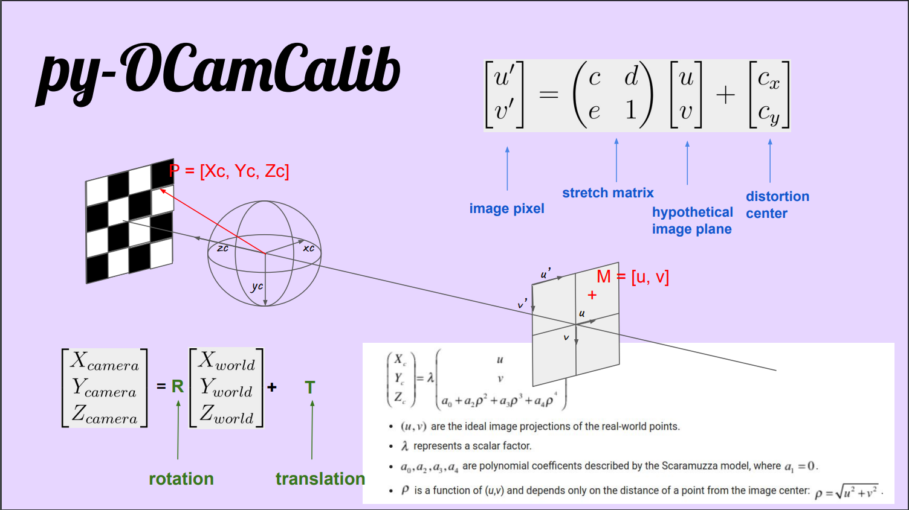
</p>

Py-OCamCalib is a pure Python/Numpy implementation of <a href="https://rpg.ifi.uzh.ch/people_scaramuzza.html">Scaramuzzas</a> 
<a href="https://sites.google.com/site/scarabotix/ocamcalib-omnidirectional-camera-calibration-toolbox-for-matlab">OcamCalib</a> Toolbox.

📚 This work is based on: \
Scaramuzza, D., Martinelli, A. and Siegwart, R., (2006). <a href="https://rpg.ifi.uzh.ch/docs/ICVS06_scaramuzza.pdf">"A Flexible Technique for Accurate Omnidirectional Camera Calibration and Structure from Motion", Proceedings of IEEE International Conference of Vision Systems (ICVS'06), New York, January 5-7, 2006. </a>\
Urban, S.; Leitloff, J.; Hinz, S. (2015): <a href="https://www.ipf.kit.edu/downloads/Preprint_ImprovedWideAngleFisheyeAndOmnidirectionalCameraCalibration.pdf">Improved Wide-Angle, Fisheye and Omnidirectional Camera Calibration. ISPRS Journal of Photogrammetry and Remote Sensing 108, 72-79.</a>

The key features are:

* **Easy to use**: It's easy to use for the final users. Two lines in the terminal.
* **Chessboard corners detection**: Automatic chessboard corners detection and optional manual correction to prevent miss detection.
* **Calibration parameters**: Calibration parameters are saved in .json file to better portability.
* **Camera model**: Once calibration is done, the camera class is ready to use. Load the calibration file and use all the predefined mapping 
 functions (world to pixel, pixel to world, undistorted, equirectangular projection, ...) in your project.

## Installation

```commandline
git clone https://github.com/jakarto3d/py-OCamCalib.git
cd py-OCamCalib

# for conda user 
conda env create --file environment.yml
conda activate py-OCamCalib

# for virtualenv user 
python3 -m venv env
source env/bin/activate
pip install -r requirements.txt
```

## Example
./test_images contains images of chessboard pattern taken from three differences fisheye lens.
You can use it to test the project.

### Use case 1 : Automatic detection and no check 
```commandline
python calibration_script.py ./../../test_images/fish_1 8 6  --camera-name fisheye_1
```

### Use case 2 : Automatic detection and check 
```commandline
python calibration_script.py ./../../test_images/fish_1 8 6  --camera-name fisheye_1 --check
```
⚠️**Manual corners verification is not verify intuitive !**

*Instructions*:

Once the opencv windows is opened, you can enter in two different mode : SELECTION MODE and DRAW MODE.
 
 **SELECTION MODE**: Press 's' to enter the mode. Selection mode allows you to select points that have not been detected
 accurately. After pressing 's' you can surround such point with bounding box by pressing left mouse, drawing
 bounding boxes **AND** confirm by pressing enter. Once you select all your points, you have to quit selection mode by
 pressing 'esc'. Selected points should appear RED. 

 **DRAW MODE**: Press 'd' each time you want draw the new point and click to drop off your modified points. New point 
 have to be drawn in same order then selected points.

 When work is done, press 'z' to quit. A windows with your modified pattern should appear.

### Use case 3 : Load corners from file  
```commandline
python calibration_script.py ./../../test_images/fish_1 8 6  --camera-name fisheye_1 --corners-path ./../checkpoints/corners_detection/detections_fisheye_1_09092022_053310.pickle
```

## Some notes about the implementation and the camera model (WIP)

## Fisheye camera model
The Computer Vision Toolbox calibration algorithm uses the fisheye camera model proposed by Scaramuzza. 
The model uses an omnidirectional camera model. The process treats the imaging system as a compact system. 
In order to relate a 3-D world point on to a 2-D image, you must obtain the camera extrinsic and intrinsic parameters. 
World points are transformed to camera coordinates using the extrinsics parameters. 
The camera coordinates are mapped into the image plane using the intrinsics parameters.

### Extrinsics parameters
The extrinsic parameters consist of a rotation, R, and a translation, t. The origin of the camera's coordinate system
is at its optical center (the point of intersection of the lens' optical axis with the camera's sensing plane) and 
its x- and y-axis define the image plane. 
<p float="left">
  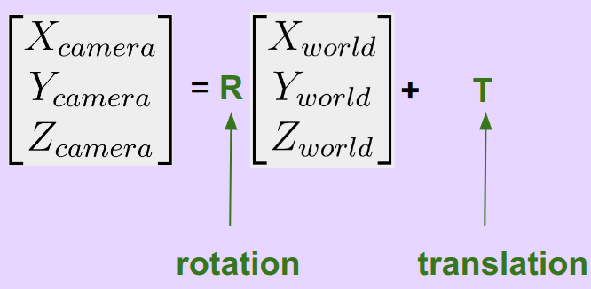
  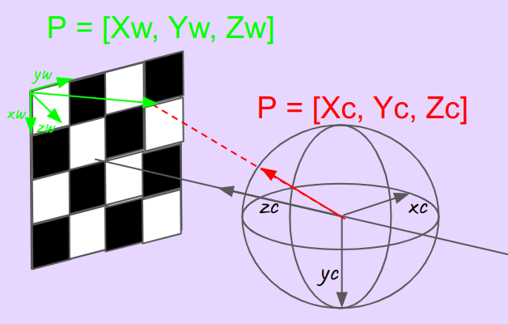
</p>

### Intrinsics parameters
Intrinsics parameters allow to map world point [Xc, Yc, Zc] from the camera's coordinate system to the image plane in
pixel coordinates.  
There are several canonical fisheye projections to model this projection (stereographic, equidistant, equisolid, ...).
However, it's unlikely that the camera you wish to calibrate fit exactly with these projections. These cameras use a 
complex series of lenses that can't fit accurately to a mathematical model du to physical manufacturing. 
Hence, Scaramuzza's model propose to fit a polynomial to find the accurate function $f(\rho) = \theta$.
<p>
  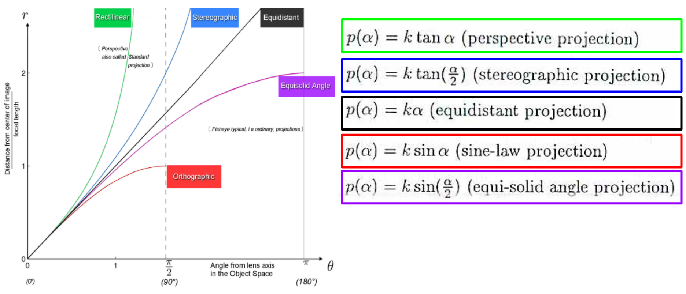
</p>

The following equation maps an image point into its corresponding 3-D vector.
<p>
  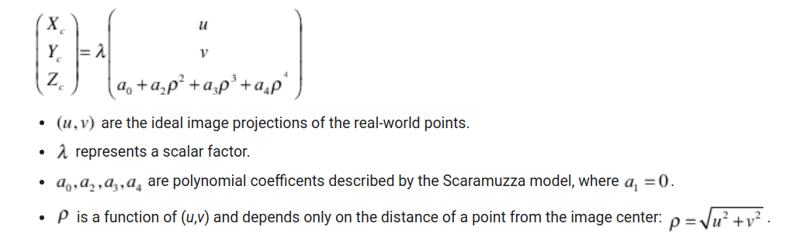
</p>

The intrinsic parameters also account for stretching and distortion. The stretch matrix compensates for the sensor-to-lens
misalignment, and the distortion vector adjusts the (0,0) location of the image plane.
<p>
  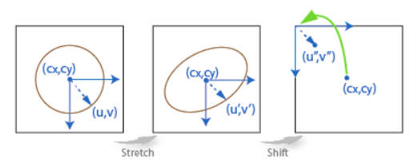
</p>

The following equation relates the real distorted coordinates (u'',v'') to the ideal distorted coordinates (u,v).
<p>
  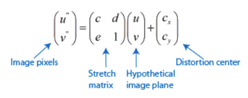
</p>

### The inverse polynomial function
The direct polynomial is used to map a point from the image plane into its corresponding 3-D vector. However, you might 
need to the inverse projection to map a 3-D vector in the camera's coordinate into it's corresponding point in the image
plane. On way is to find is to find the solution of the following system of equations :  
<p>
  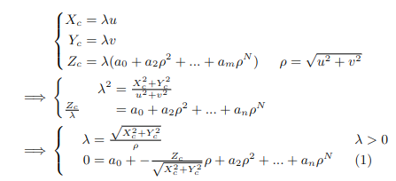
</p>
One need to find the roots of (1), take the minimum of the real one, inject in $\lambda$ and get the couple $(u, v)$.<br/>

One other way, which is much faster, is to fit a polynomial function (which is the so-called inverse polynomial) using 
some samples from the previous method. This mean to get ${(\rho_i, \theta_i)}_{i \in [1, N]}$ using previous method and 
fit a polynom $P$ such that $\forall i \in [1, N], P(\theta_i) = \rho_i $. The degree of $P$ is determined in the following 
way: fix the maximal error $\alpha$ desired and  increase the degree of $P$ until $ \sum \frac{|P(\theta_i) - \rho_i|}{N} < \alpha$.<br/>
The number of sample $N$ is not so important, $N\approx100$ give accurate results. However, one should take care to sample 
the incident angle $\theta$ uniformly in $[0, \pi]$ (not until $\pi$ because fitting function may raise poorly 
conditioned warning but almost, $0.9\pi$ give accurate results). Even if the camera cannot have a field of view of 360 degrees,
inverse polynomial should stay consistent (which mean rho have to always increase with theta) for the entire field of view.
Here is an example of strange behavior for $\theta$ sampled between $[0, 0.6\pi]$:
<p>
  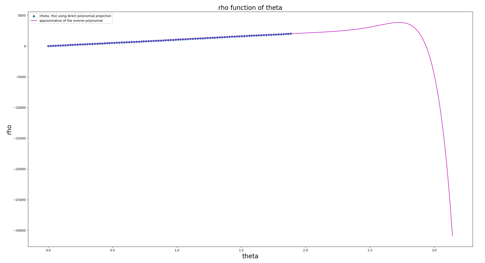
</p>
Here is the same for $\theta$ sampled between $[0, 0.9\pi]$, now result is consistent:
<p>
  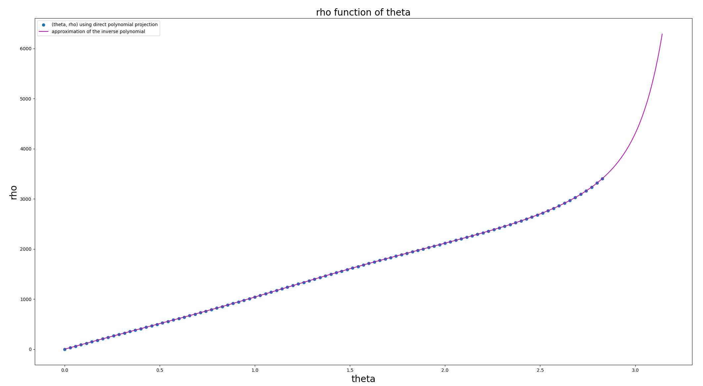
</p>

### Image projection conversion

This section describe the process where the initial fisheye image is projection-transformed into a Rectilinear image. This
process is often referred as "image distortion correction" but it poorly makes sens and can be really confusing. The perpective 
(aka rectilinear) projection is generally considered to be the Reference, and so the convention is to talk about "unwanted distortion"
and "correction" each time projection differ from this ideal (i.e. a straight line must be straight).  <br/>
However, if you take a fisheye camera that perfectly follow an ideal equidistant projection, why should we need to talk about
"distortion" or "correction" ? Maybe, we should talk about distortion if use equidistant projection to model our camera but 
it doesn't fit exactly with our camera, so we may want to correct or distort our equidistant model to fit exactly with the camera.
And then, for a project, we may need to CONVERT image from this camera to Rectilinear image. <br/>
That why I prefer to talk about Image projection CONVERSION than "undistortion" to refer to the process of fisheye-rectilinear transformation.<br/>
<a href="http://michel.thoby.free.fr/Fisheye_history_short/Projections/Fisheye_projection-models.html">Here is an interesting article on the subject.

<p float="left">
  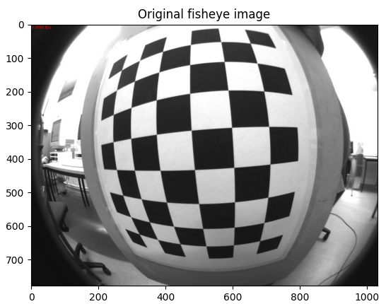
  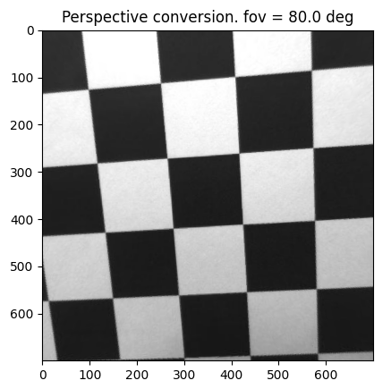
</p>

```commandline
python projection_conversion_script.py ../../../test_images/fish_1/Fisheye1_1.jpg ../checkpoints/calibration/calibration_fisheye_1_18052022_154907.json 80 700 700
```


